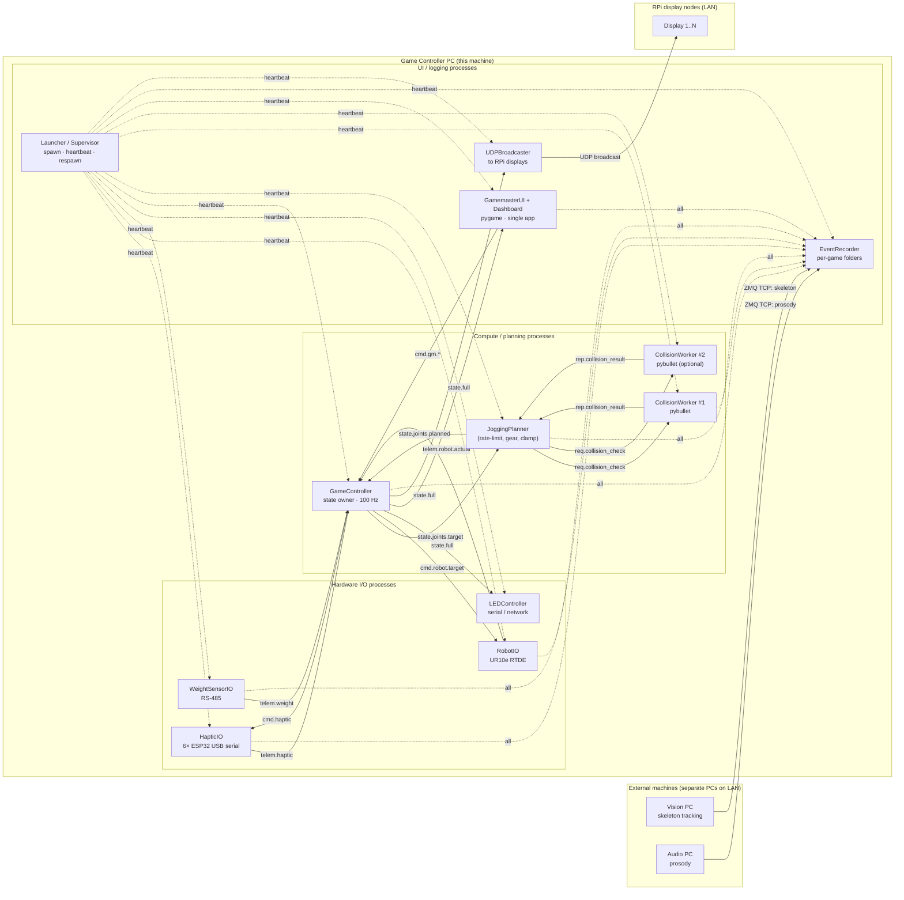

# System Map

This document is the single source of truth for **what processes exist, who
talks to whom, in which direction, at what rate, and over what transport**.
Implementation details for each subsystem live in
[`subsystems/`](subsystems/) (to be filled in subsequent passes).

Status: **DRAFT — open for edits**. Last reviewed: 2026-06-02.

---

## 1. Design rules

1. **One process per timing concern.** Each process has its own loop and its
   own target frequency. Crashes are isolated.
2. **One bus, one wire format.** All inter-process traffic is ZeroMQ with
   JSON payloads. No shared memory, no `multiprocessing.Manager`, no ad-hoc
   sockets.
3. **Hardware-native protocols stop at the I/O process boundary.** USB
   serial, RTDE, and RS-485 live only inside their respective I/O processes.
   Everyone else sees them only through bus topics.
4. **State is owned by the GameController.** All other processes are either
   producers of telemetry into GC or consumers of state from GC.
5. **Every process is independently runnable** against recorded input or a
   simulated peer. No process requires hardware to start.
6. **Every message is recorded.** The EventRecorder taps the bus and writes
   a per-game folder; bug repro and integration tests both replay these.

---

## 2. Process map



---

## 3. Process catalog

| Process | Role | Target rate | Hardware-facing | Bus role |
|---------|------|-------------|-----------------|----------|
| `GameController` (GC) x1 | State owner, game state machine, scoring | 50 Hz | none | PUB state, SUB cmds & telemetry |
| `HapticIO` x1 | ESP32 USB serial reader/writer (x12 USB devices) | 50–200 Hz/board | 12× USB serial | PUB telemetry, SUB cmds |
| `RobotIO` (x1 or x2) | UR10e RTDE bridge (x2 robots) | 100 Hz | RTDE TCP over 2x ethernet | PUB actuals, SUB targets |
| `JoggingPlanner` (x1 or x2)| Unit conv, gearing, clamp, rate-limit, collision check | Follow GameController 50Hz | none | SUB targets, PUB planned, REQ collision |
| `CollisionWorker` (N≥1) | pybullet trajectory check | on demand | none | REP collision |
| `WeightSensorIO` x1 | RS-485 load cell reader (x 6 cells) | 40-50 Hz (as fast as 485 allows) | RS-485 over USB | PUB telemetry |
| `LightColumnController` | LED strip / column driver | 40-50 Hz (as fast as 485 allows) | RS-485 over USB | SUB state (CONFLATE) |
| `DisplayBroadcaster` | Bridges bus → UDP for RPi displays | ~50 Hz (driven by every state update) | UDP out over ethernet | SUB state |
| `ScoreboardBroadcaster` | RS485 sender for LED Scoreboard displays | ~50 Hz (driven by every state update) | RS485 out over USB | SUB state |
| `BucketController` | RS485 sender for 6x motorized bucket | on demand | RS485 out over USB | PUB + SUB state |
| `ButtonController` | RS485 reader for play / stop / e-stop push buttons | 50 Hz | RS485 out over USB | PUB state |
| `SafetyBarrierController` | RS485 reader for safety light barrier | 50 Hz | RS485 out over USB | PUB state |
| `GamemasterUI` | Single pygame app: gamemaster controls + realtime dashboard | 40–50 Hz | keyboard/mouse | SUB state, REQ cmds |
| `EventRecorder` | Per-game folder writer | n/a (event-driven) | filesystem, ZMQ TCP from external PCs | SUB all topics |
| `Launcher / Supervisor` | Spawn, heartbeat, restart | 1 Hz | OS | SUB heartbeats |

---

## 4. Edge characterization

Direction column reads "A → B" for one-way and "A ↔ B" for two-way.

| # | Edge | Direction | Rate | Latency budget | ZMQ pattern | Notes |
|---|------|-----------|------|---------------|-------------|-------|
| 1 | HapticIO ↔ ESP32 | 2-way | 50–200 Hz | ~5 ms | not on bus | USB serial |
| 2 | HapticIO → GC | 1-way | 50 Hz | < 5 ms | PUB/SUB | telemetry |
| 3 | GC → HapticIO | 1-way | 50 Hz | < 10 ms | PUB/SUB + CONFLATE | force feedback, latest-wins |
| 4 | RobotIO ↔ UR10e | 2-way | 100 Hz | hard-RT | not on bus | RTDE |
| 5 | GC ↔ RobotIO | 2-way | 100 Hz each | < 10 ms | PUB/SUB (both dirs) | targets out, actuals in |
| 6 | GC ↔ JoggingPlanner | 2-way | 100 Hz | < 10 ms | PUB/SUB or in-process | see §6 |
| 7 | JP ↔ CollisionWorker(s) | request/reply | 10–50 Hz | 5–50 ms | REQ → ROUTER/DEALER → REP | load-balanced fan-out, see §5 |
| 8 | GC → LED | 1-way | 30–60 Hz | loose | PUB/SUB + CONFLATE | canonical slow-subscriber case |
| 9 | WeightSensorIO → GC | 1-way | 40–50 Hz | loose | PUB/SUB | telemetry |
| 10 | GC → UDPBroadcaster → RPi | 1-way | 50 Hz | loose | PUB/SUB internally, UDP outward | RPi protocol unchanged |
| 11 | UI ↔ GC | 2-way | state 50 Hz, cmds rare | < 50 ms | SUB state + REQ/REP cmds | acks for stage changes etc. |
| 12 | All procs → EventRecorder | fan-in | all topics | offline | SUB-all | recorder is purely passive |
| 13 | Vision/Audio PC → EventRecorder | 1-way LAN | 30 Hz / continuous | offline | ZMQ TCP (PUSH/PULL or PUB/SUB) | same library across machines |
| 14 | Supervisor ↔ all | heartbeat + spawn | 1 Hz | n/a | PUB heartbeat per proc; OS spawn | see §7 |

---

## 5. Collision worker fan-out and respawn (answers the pybullet question)

**Yes** — ZMQ supports exactly this pattern. We use a tiny `ROUTER/DEALER`
broker so that the JoggingPlanner is a single REQ client and any number of
`REP` workers can connect and serve. The broker fairly distributes requests
to whichever worker is idle.

```
JoggingPlanner (REQ) --> tcp://*:5560 (ROUTER) <--> tcp://*:5561 (DEALER) <-- CollisionWorker #1 (REP)
                                                                          <-- CollisionWorker #2 (REP)
                                                                          <-- CollisionWorker #N (REP)
```

Properties:

1. **Crash isolation** — if worker #2 segfaults inside pybullet, the OS
   reaps it. The DEALER socket simply stops routing to it. In-flight
   requests on worker #2 are lost; JP sees a timeout on `req.recv()`.
2. **Continued service** — workers #1 and #N keep answering new requests
   immediately. No other process is affected.
3. **Detection** — the Supervisor sees a missed heartbeat from worker #2
   (each worker PUBs `heartbeat.collision_worker_2` at 1 Hz).
4. **Respawn** — the Supervisor calls `Popen([...])` to start a fresh
   worker. When it comes up, it connects to the DEALER and immediately
   starts taking work.
5. **Recompute on another instance** — JP's contract is: if `req.recv()`
   times out within T ms, retry on the broker (the broker routes to the
   next idle worker). With N≥2 workers this means a single worker crash
   causes one delayed check, never a missing check.
6. **Pre-emptive respawn** — the Supervisor can optionally kill and
   respawn all collision workers at the start of every Idle→Tutorial
   transition, as a "fresh slate" policy. Trivial to add later.

The JP retry skeleton:

```python
def check(q_start, q_goal, timeout_ms=80, retries=2):
    for _ in range(retries):
        req.send_json({"q_start": q_start, "q_goal": q_goal})
        if req.poll(timeout_ms):
            return req.recv_json()
        # timeout: rebuild socket (REQ state machine requires this) and retry
        rebuild_req_socket()
    return {"ok": False, "reason": "all_workers_unresponsive"}
```

Caveats:

- Plain `REQ` sockets get stuck after a timeout; the rebuild is one line
  but it's a real gotcha. Alternative: use `DEALER` on the JP side too
  and tag each request with an id.
- Workers must be **stateless between requests** for load-balancing to
  be safe. pybullet world setup happens once at startup, then each
  request is a self-contained "given joint trajectory, does it hit
  anything?" call.

---

## 6. Where does the JoggingPlanner live?

Two viable placements; either is compatible with this map:

- **In-process inside GameController** — a normal Python module called
  from the 100 Hz loop. Zero IPC latency, deterministic ordering.
  Recommended for now. (Current implementation choice)
- **Its own process** — required if planning becomes slow (multi-step
  collision-aware planning) so the 100 Hz state tick is not stalled.

Switching between the two does not change any other process: the only
difference is who publishes `state.joints.planned`.

---

## 7. Launcher / Supervisor

Responsibilities, in order of importance:

1. Read the active profile (`config/profiles/<name>.yaml`) and decide which
   processes to start.
2. Spawn each enabled process with `subprocess.Popen`, injecting
   `PROC_NAME` and bus endpoints via env vars.
3. Subscribe to `heartbeat.<proc>` topics. Each process PUBs a heartbeat
   at 1 Hz containing `{ts, pid, loop_hz}`.
4. If a heartbeat is silent for > N seconds, log the crash, kill the
   process if still alive, and respawn it (configurable per-process
   policy: `always` | `at_game_start` | `never`).
5. On Ctrl-C or shutdown command, send SIGTERM to all children, wait,
   then SIGKILL stragglers.

Respawn defaults (subject to change after smoke tests):

| Process | Policy |
|---------|--------|
| CollisionWorker(s) | `always` (and optionally `at_game_start`) |
| HapticIO | `always` |
| RobotIO | `always` |
| WeightSensorIO | `always` |
| LEDController | `always` |
| UDPBroadcaster | `always` |
| EventRecorder | `always` |
| JoggingPlanner | `always` |
| GameController | `never` (a GC crash ends the run; supervisor exits) |
| GamemasterUI | `never` (pygame on main thread, gamemaster will notice) |

---

## 8. Bus topology and topic naming

- Endpoints: all on `tcp://127.0.0.1:<port>` for now. Switch to `ipc://`
  later if profiling shows TCP overhead matters; switch to `tcp://*:...`
  to expose any topic to another machine.
- Topic conventions:
  - `state.<scope>` — authoritative state published by GC.
  - `telem.<source>` — raw observations from I/O processes.
  - `cmd.<target>.<verb>` — commands directed at a specific process.
  - `req.<service>` / `rep.<service>` — request/reply traffic.
  - `heartbeat.<proc>` — supervisor liveness pings.
  - `log.<proc>` — reserved for future use (currently unused; see logging doc).

Concrete port assignments to be fixed in `docs/architecture/BUS.md` once
this map is approved. (This map is okay, please proceed)

---

## 9. Open items

- Confirm collision worker count for the deployed machine (1 vs 2 vs 4) : Confirm to use 16 workers for both robots
- Confirm whether `LEDController` is one process for all strips or one
  per device: Confirm to use one process.
- Confirm whether the external Vision/Audio PCs use `PUSH` (fire and
  forget) or `PUB` (so the recorder can choose what to subscribe to).
- Confirm whether the `JoggingPlanner` starts in-process inside GC or as
  its own process from day one.
