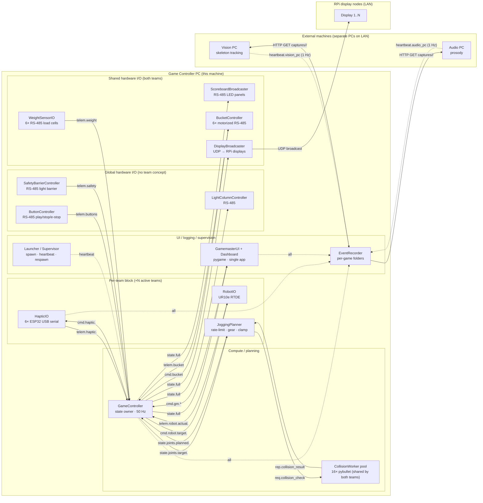

# System Map

This document is the single source of truth for **what processes exist, who
talks to whom, in which direction, at what rate, and over what transport**.
Implementation details for each subsystem live in
[`subsystems/`](subsystems/) (to be filled in subsequent passes).

Status: **Kind of CONFIRMED — still open for edits**. Last reviewed: 2026-06-02.

---

## 1. Design rules

1. **One process per timing concern.** Each process has its own loop and its
   own target frequency. Crashes are isolated.
2. **One bus, one wire format.** All inter-process traffic is ZeroMQ with
   JSON payloads. No shared memory, no `multiprocessing.Manager`, no ad-hoc
   sockets.
3. **Hardware-native protocols stop at the I/O process boundary.** USB
   serial, RTDE, and RS-485 live only inside their respective I/O processes.
   Everyone else sees them only through bus topics.
4. **State is owned by the GameController.** All other processes are either
   producers of telemetry into GC or consumers of state from GC.
5. **Every process is independently runnable** against recorded input or a
   simulated peer. No process requires hardware to start.
6. **Every message is recorded.** The EventRecorder taps the bus and writes
   a per-game folder; bug repro and integration tests both replay these.
7. **One RS-485 USB adapter per process.** Every RS-485 owning process
   (WeightSensor, LightColumn, Scoreboard, Bucket, Button, SafetyBarrier)
   has its own physical USB-to-RS485 adapter. No bus is shared between
   processes.

---

## 2. Process map

Two teams (A and B) exist. Some subsystems run as **2 instances** (one per
team), others run as a **single shared instance**. The diagram below
collapses the per-team duplication into a single "per-team" block; mentally
duplicate that block once per active team. Section 3 lists exact instance
counts.



---

## 3. Process catalog

Instance count column: `1` = single shared process, `×team` = one per
active team (1 or 2), `×N` = pool of N workers.

| Process | Instances | Role | Target rate | Hardware-facing | Bus role |
|---------|-----------|------|-------------|-----------------|----------|
| `GameController` (GC) | 1 | State owner, game state machine, scoring | 50 Hz | none | PUB state, SUB cmds & telemetry |
| `HapticIO` | ×team | ESP32 USB serial reader/writer (6 dials/team) | 50–200 Hz/board | 6× USB serial per team | PUB telemetry, SUB cmds |
| `RobotIO` | ×team | UR10e RTDE bridge | 100 Hz | RTDE TCP over ethernet | PUB actuals, SUB targets |
| `JoggingPlanner` | ×team | Unit conv, gearing, clamp, rate-limit, collision check | Follows GC 50 Hz | none | SUB targets, PUB planned, REQ collision |
| `CollisionWorker` | ×16 | pybullet trajectory check (shared pool serves both teams; identical robot cells) | on demand | none | REP collision |
| `WeightSensorIO` | 1 | RS-485 load cell reader (6 cells total, IDs 11/12/13 + 21/22/23) | 40–50 Hz | RS-485 over USB | PUB telemetry |
| `LightColumnController` | 1 | LED column driver (global, not per-team) | 40–50 Hz | RS-485 over USB | SUB state (CONFLATE) |
| `DisplayBroadcaster` | 1 | Bridges bus → UDP for RPi displays (both teams) | ~50 Hz | UDP out over ethernet | SUB state |
| `ScoreboardBroadcaster` | 1 | RS-485 sender for LED scoreboard panels (both teams) | ~50 Hz | RS-485 over USB | SUB state |
| `BucketController` | 1 | RS-485 driver for 6× motorized buckets (both teams) | on demand | RS-485 over USB | PUB telem + SUB cmd |
| `ButtonController` | 1 | RS-485 reader for play / stop / e-stop push buttons (global) | 50 Hz | RS-485 over USB | PUB telemetry |
| `SafetyBarrierController` | 1 | RS-485 reader for safety light barrier (global) | 50 Hz | RS-485 over USB | PUB telemetry |
| `GamemasterUI` | 1 | Single pygame app: gamemaster controls + realtime dashboard | 40–50 Hz | keyboard/mouse | SUB state, REQ cmds |
| `EventRecorder` | 1 | Per-game folder writer | event-driven | filesystem, ZMQ TCP from external PCs | SUB all topics |
| `Launcher / Supervisor` | 1 | Spawn, heartbeat, restart | 1 Hz | OS | SUB heartbeats |

**Active teams** are controlled in YAML config. Valid modes:
`team_a_only`, `team_b_only`, `both_teams`. The Launcher uses this to
decide how many `HapticIO` / `RobotIO` / `JoggingPlanner` instances to
spawn. Shared/global processes are always spawned regardless.

---

## 4. Edge characterization

Direction column reads "A → B" for one-way and "A ↔ B" for two-way.
Topic suffix `.<team>` is emitted once per active team (`a` and/or `b`).

| # | Edge | Direction | Rate | Latency budget | ZMQ pattern | Notes |
|---|------|-----------|------|----------------|-------------|-------|
| 1 | HapticIO ↔ ESP32 | 2-way | 50–200 Hz | ~5 ms | not on bus | USB serial |
| 2 | HapticIO → GC | 1-way | 50 Hz | < 5 ms | PUB/SUB | `telem.haptic.<team>` |
| 3 | GC → HapticIO | 1-way | 50 Hz | < 10 ms | PUB/SUB + CONFLATE | `cmd.haptic.<team>`, latest-wins |
| 4 | RobotIO ↔ UR10e | 2-way | 100 Hz | hard-RT | not on bus | RTDE |
| 5 | GC ↔ RobotIO | 2-way | 100 Hz each | < 10 ms | PUB/SUB (both dirs) | targets out, actuals in, per team |
| 6 | GC ↔ JoggingPlanner | 2-way | 50 Hz | < 10 ms | PUB/SUB or in-process | see §6 |
| 7 | JP ↔ CollisionWorker pool | request/reply | 10–50 Hz | 5–50 ms | REQ → ROUTER/DEALER → REP | 16 workers, shared by both teams, see §5 |
| 8 | GC → LightColumnController | 1-way | 30–60 Hz | loose | PUB/SUB + CONFLATE | canonical slow-subscriber case |
| 9 | WeightSensorIO → GC | 1-way | 40–50 Hz | loose | PUB/SUB | `telem.weight` (all 6 cells) |
| 10 | GC → DisplayBroadcaster → RPi | 1-way | 50 Hz | loose | PUB/SUB internally, UDP outward | RPi protocol unchanged |
| 11 | GC → ScoreboardBroadcaster | 1-way | 50 Hz | loose | PUB/SUB + CONFLATE | RS-485 outward to LED panels |
| 12 | GC ↔ BucketController | 2-way | on demand + 5 Hz telem | loose | PUB/SUB both dirs | `cmd.bucket`, `telem.bucket` |
| 13 | ButtonController → GC | 1-way | 50 Hz | < 20 ms | PUB/SUB | `telem.buttons` (debounced edges) |
| 14 | SafetyBarrierController → GC | 1-way | 50 Hz | < 20 ms | PUB/SUB | `telem.safety` (barrier broken → soft-stop) |
| 15 | UI ↔ GC | 2-way | state 50 Hz, cmds rare | < 50 ms | SUB state + REQ/REP cmds | acks for stage changes etc. |
| 16 | All procs → EventRecorder | fan-in | all topics | offline | SUB-all | recorder is purely passive |
| 17 | Vision/Audio PC → EventRecorder | 1-way LAN | post-game (file pull) | offline | HTTP GET + 1 Hz heartbeat on bus | see BUS.md §11 |
| 18 | Supervisor ↔ all | heartbeat + spawn | 1 Hz | n/a | PUB heartbeat per proc; OS spawn | see §7 |

---

## 5. Collision worker fan-out and respawn

The deployed machine runs **16 CollisionWorker instances**, shared between
both teams. Both robot cells are identical (same URDF, same world) and the
two teams' arms never reach each other, so a single pool can serve either
team's planner. We use a tiny `ROUTER/DEALER` broker so any JoggingPlanner
is a REQ client and any number of `REP` workers can connect and serve. The
broker fairly distributes requests to whichever worker is idle.

```
JP team_a (REQ) ┐
                ├─> tcp://*:5560 (ROUTER) <-> tcp://*:5561 (DEALER) <-- CollisionWorker #1  (REP)
JP team_b (REQ) ┘                                                  <-- CollisionWorker #2  (REP)
                                                                   <-- ...
                                                                   <-- CollisionWorker #16 (REP)
```

Properties:

1. **Crash isolation** — if a worker segfaults inside pybullet, the OS
   reaps it. The DEALER socket simply stops routing to it. In-flight
   requests on that worker are lost; JP sees a timeout on `req.recv()`.
2. **Continued service** — the remaining workers keep answering new
   requests immediately. No other process is affected.
3. **Detection** — the Supervisor sees a missed heartbeat from the dead
   worker (each worker PUBs `heartbeat.collision_worker_<n>` at 1 Hz).
4. **Respawn** — the Supervisor calls `Popen([...])` to start a fresh
   worker. When it comes up, it connects to the DEALER and immediately
   starts taking work.
5. **Recompute on another instance** — JP's contract is: if `req.recv()`
   times out within T ms, retry on the broker (the broker routes to the
   next idle worker). With 16 workers a single crash is a non-event.
6. **Pre-emptive respawn** — the Supervisor can optionally kill and
   respawn all collision workers at the start of every Idle→Tutorial
   transition, as a "fresh slate" policy. Trivial to add later.

The JP retry skeleton:

```python
def check(q_start, q_goal, timeout_ms=80, retries=2):
    for _ in range(retries):
        req.send_json({"q_start": q_start, "q_goal": q_goal})
        if req.poll(timeout_ms):
            return req.recv_json()
        # timeout: rebuild socket (REQ state machine requires this) and retry
        rebuild_req_socket()
    return {"ok": False, "reason": "all_workers_unresponsive"}
```

Caveats:

- Plain `REQ` sockets get stuck after a timeout; the rebuild is one line
  but it's a real gotcha. Alternative: use `DEALER` on the JP side too
  and tag each request with an id.
- Workers must be **stateless between requests** for load-balancing to
  be safe. pybullet world setup happens once at startup, then each
  request is a self-contained "given joint trajectory, does it hit
  anything?" call.

---

## 6. Where does the JoggingPlanner live?

Two viable placements; either is compatible with this map:

- **In-process inside GameController** — a normal Python module called
  from the 50 Hz loop. Zero IPC latency, deterministic ordering.
  Recommended for initial bring-up.
- **Its own process per team** — required if planning becomes slow
  (multi-step collision-aware planning) so the 50 Hz state tick is not
  stalled. This is the long-term target and is what the diagram shows.

Switching between the two does not change any other process: the only
difference is who publishes `state.joints.planned.<team>`.

---

## 7. Launcher / Supervisor

Responsibilities, in order of importance:

1. Read the active profile (`config/profiles/<name>.yaml`) and decide which
   processes to start (including which teams are active).
2. Spawn each enabled process with `subprocess.Popen`, injecting
   `PROC_NAME`, `TEAM` (where applicable), and bus endpoints via env vars.
3. Subscribe to `heartbeat.<proc>` topics. Each process PUBs a heartbeat
   at 1 Hz containing `{ts, pid, loop_hz}`.
4. If a heartbeat is silent for > N seconds, log the crash, kill the
   process if still alive, and respawn it (configurable per-process
   policy: `always` | `at_game_start` | `never`).
5. On Ctrl-C or shutdown command, send SIGTERM to all children, wait,
   then SIGKILL stragglers.

Respawn defaults (subject to change after smoke tests):

| Process | Policy |
|---------|--------|
| CollisionWorker (×16) | `always` (and optionally `at_game_start`) |
| HapticIO (×team) | `always` |
| RobotIO (×team) | `always` |
| JoggingPlanner (×team) | `always` |
| WeightSensorIO | `always` |
| LightColumnController | `always` |
| DisplayBroadcaster | `always` |
| ScoreboardBroadcaster | `always` |
| BucketController | `always` |
| ButtonController | `always` |
| SafetyBarrierController | `always` |
| EventRecorder | `always` |
| GameController | `never` (a GC crash ends the run; supervisor exits) |
| GamemasterUI | `never` (pygame on main thread, gamemaster will notice) |

---

## 8. Bus topology and topic naming

- Endpoints: all on `tcp://127.0.0.1:<port>` for now. Switch to `ipc://`
  later if profiling shows TCP overhead matters; switch to `tcp://*:...`
  to expose any topic to another machine.
- Topic conventions:
  - `state.<scope>` — authoritative state published by GC.
  - `telem.<source>[.<team>]` — raw observations from I/O processes.
  - `cmd.<target>[.<team>].<verb>` — commands directed at a specific process.
  - `req.<service>` / `rep.<service>` — request/reply traffic.
  - `heartbeat.<proc>` — supervisor liveness pings.
  - `log.<proc>` — reserved for future use (currently unused; see logging doc).
- The `.<team>` suffix is `a` or `b` and is present only on per-team
  topics (Haptic / Robot / Jogging). Shared and global subsystems use
  unsuffixed topics.

Concrete port assignments to be fixed in `docs/architecture/BUS.md` once
this map is approved.

---

## 9. Resolved decisions log

Settled while drafting this map. Kept here so future readers don't
re-litigate them.

- **CollisionWorker count:** 16 workers, shared across both teams.
- **LightColumnController:** one process for all LED column devices, not
  one process per device.
- **External Vision/Audio PCs:** skeleton and audio data are pulled by
  the EventRecorder over HTTP from each external PC **after** the game
  ends (Conclusion → Reset triggers a `POST /game_ended` from GC).
  Only a 1 Hz `heartbeat.vision_pc` / `heartbeat.audio_pc` rides the
  realtime bus for liveness. See BUS.md §11.
- **JoggingPlanner placement:** starts in-process inside GameController
  (see §6). Promotion to its own process happens when planning latency
  forces it. The bus contract does not change.
- **Per-team duplication:** HapticIO, RobotIO, JoggingPlanner run as
  one process per active team. WeightSensor, Scoreboard, Bucket,
  DisplayBroadcaster are single shared processes. LightColumn, Button,
  SafetyBarrier are global (no team concept).
- **RS-485 buses:** one USB adapter per RS-485 owning process. No
  shared buses.
